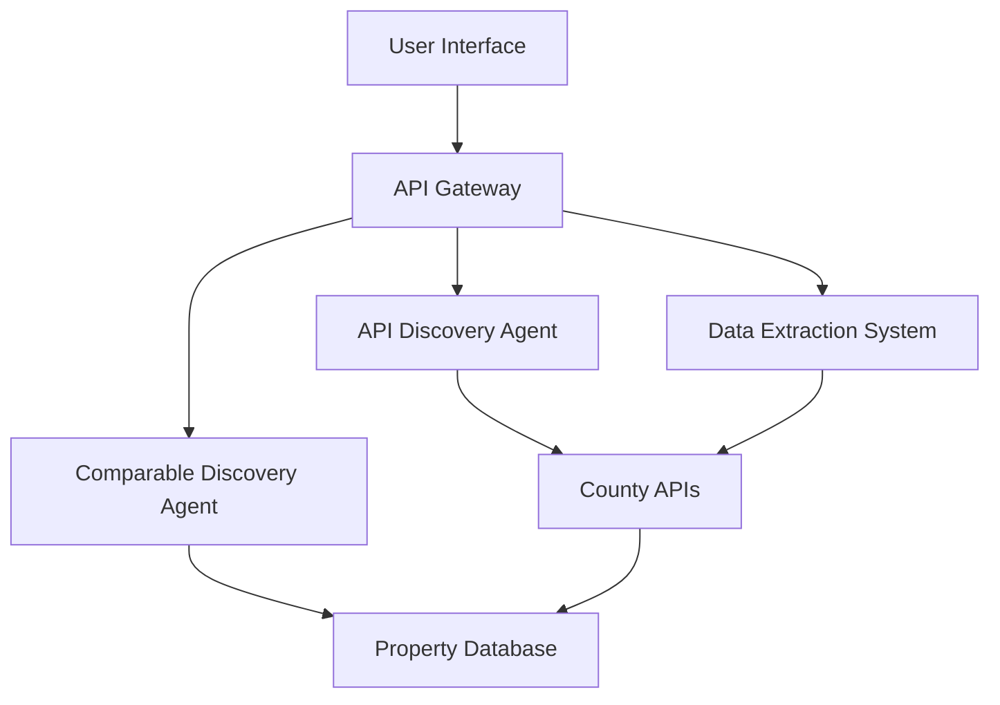
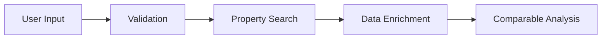

# Starboard - Application Flow

## 1. System Architecture Overview

## 2. Component Interactions

### 2.1 API Discovery Agent Flow
1. **Initial API Analysis**
   - Scan county API documentation
   - Identify authentication methods
   - Map available endpoints
   - Document rate limits

2. **Data Field Mapping**
   - Create unified field schema
   - Map county-specific fields to standard schema
   - Document field transformations
   - Handle missing field scenarios

3. **Rate Limit Management**
   - Monitor API usage
   - Implement request queuing
   - Handle rate limit errors
   - Optimize batch requests

### 2.2 Data Extraction System Flow
1. **Property Data Collection**
   - Filter industrial properties
   - Validate data formats
   - Transform to unified schema
   - Store in database

2. **Data Validation**
   - Check required fields
   - Validate data types
   - Flag suspicious values
   - Generate quality metrics

3. **Error Handling**
   - Log validation errors
   - Track API failures
   - Maintain error context
   - Trigger retries

### 2.3 Comparable Discovery Agent Flow
1. **Property Analysis**
   - Extract key features
   - Normalize property data
   - Calculate market metrics
   - Generate property profile

2. **Comparison Engine**
   - Find similar properties
   - Calculate similarity scores
   - Rank comparables
   - Generate confidence metrics

3. **Results Delivery**
   - Format comparison results
   - Generate insights
   - Prepare visualization data
   - Return ranked comparables

## 3. Data Flow

### 3.1 Input Processing

### 3.2 Data Storage
1. **Property Database**
   - Raw county data
   - Normalized property records
   - Comparable analysis results
   - Historical trends

2. **Cache Layer**
   - API response cache
   - Frequent comparables
   - Common queries
   - Rate limit tracking

## 4. Error Handling Strategy

1. **API Errors**
   - Rate limit exceeded
   - Authentication failure
   - Invalid requests
   - Network timeouts

2. **Data Errors**
   - Invalid property data
   - Missing required fields
   - Inconsistent formats
   - Outlier detection

3. **System Errors**
   - Processing failures
   - Database errors
   - Cache misses
   - Service unavailability

## 5. Security Measures

1. **API Security**
   - API key management
   - Rate limit compliance
   - Request authentication
   - Data encryption

2. **Data Security**
   - PII handling
   - Data retention
   - Access controls
   - Audit logging 